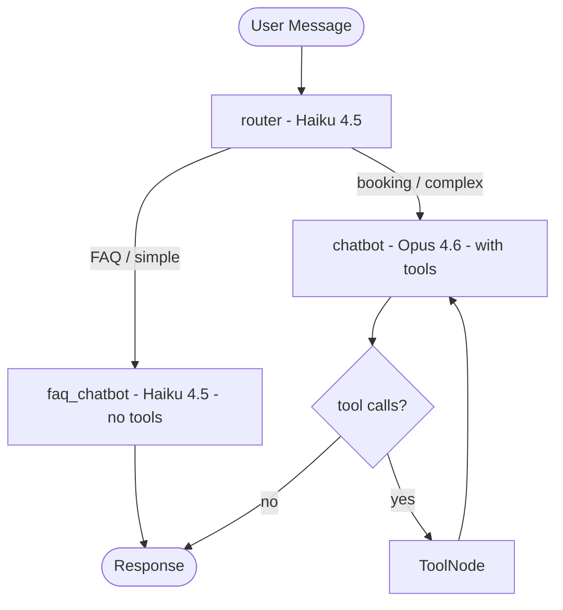

# Acme Dental AI Agent

## Your Task

Build an AI agent that allow users to book dental check-up appointments with a fictitious Acme Dental clinic through natural language conversation in a chat interface.

### The clinic

Acme Dental is a simple dental practice that offers routine check-up appointments. The clinic operates with a single dentist and uses Calendly to manage its appointment scheduling. Below are the key details you'll need to know about the clinic's operations.

**Clinic Information:**
- **Service Type**: Dental Check-up (only service offered)
- **Appointment Duration**: 30 minutes
- **Staff**: Only 1 dentist
- **Scheduling System**: Calendly
  - Calendar URL: Provided in the email.
  - Calendly Token: Provided in the email.
  - Use the Calendly API to check availability and manage bookings

### Functional Requirements

The agent must support the following core booking operations:

**1. Create New Bookings**
- Greet users and understand their booking intent
- Check available appointment slots via the Calendly calendar
- Present available time slots to users
- Help users select a suitable time slot
- Collect necessary patient information (i.e full name and email address)
- Create the booking through the Calendly API
- Provide confirmation with appointment details (date, time, duration)

**2. Reschedule Existing Bookings**
- Allow users to Reschedule their existing appointments
- Identify the booking to update
- Retrieve current appointment details
- Check availability for the new requested time slot
- Reschedule the booking through the Calendly API
- Provide updated confirmation with new appointment details

**3. Cancel Bookings**
- Allow users to cancel their appointments
- Identify the booking to cancel
- Retrieve current appointment details
- Process cancellation through the Calendly API
- Provide cancellation confirmation

**4. Answer FAQs from the Knowledge Base**: 
- A document containing the clinic's knowledge base (KB) will be provided
- Extract and process information from the docu to build a searchable knowledge basent
- Answer frequently asked questions about the clinic using information from the KB

### Non Functional Requirements

- Implement the agent using [LangGraph](https://docs.langchain.com/oss/python/langgraph/overview)
- You are free to choose the LLM model(s) or combination of models you consider most appropriate for this task
- Be aware that API integrations (e.g. Calendly) may be unreliable or experience delays.
- Document your architectural decisions

## Getting Started

### Prerequisites

- Python 3.11 or higher
- [uv](https://github.com/astral-sh/uv) package manager
- Anthropic API key (for Claude models)
- Calendly API token (for booking functionality)

### Installation

1. **Install uv** (if not already installed):

```bash
curl -LsSf https://astral.sh/uv/install.sh | sh
```

2. **Install dependencies**:

```bash
make run
```

or 

```bash
uv sync
```

3. **Set up environment variables**:

Create a `.env` file in the project root and add your API keys:

```
ANTHROPIC_API_KEY=your_anthropic_api_key_here
OPENAI_API_KEY=your_openai_api_key_here
CALENDLY_API_TOKEN=your_calendly_api_token_here
```

### Starting the Agent

To start the agent, run:

```bash
make run
```

Or directly:

```bash
uv run python src/main.py
```

You can then interact with the agent using natural language. 
Type `exit`, `quit`, or `q` to end the session.

### Development Commands

The project includes a Makefile with convenient commands:

```bash
make install    # Install dependencies
make format     # Format code with ruff
make lint       # Lint code with ruff
make check      # Format and lint code
make run        # Run the agent
make test       # Run tests
make help       # Show all available commands
```

### Example Interaction

```
You: Hello, I'd like to book an appointment
Agent: [Agent responds and guides you through booking]
```

---

## Architectural Decisions

### LangGraph Agent Architecture

The agent is built as a **LangGraph StateGraph** — an explicit, declarative state machine where nodes are functions and edges define control flow. This was chosen over simpler alternatives for three reasons:

1. **Conditional routing** — The agent must decide after every LLM call whether to execute tools or respond to the user. LangGraph's conditional edges make this a first-class concept rather than buried inside a loop.
2. **Tool-calling loops** — Booking workflows like rescheduling require multiple sequential tool calls (find booking, cancel, check availability, book new slot). The `chatbot -> tools -> chatbot` loop handles this naturally, with the LLM deciding at each iteration whether more tools are needed.
3. **Built-in conversation memory** — LangGraph's checkpointer system (`MemorySaver`) stores the full conversation state per session, so each HTTP request only needs to send the new message while the graph reconstructs the full history. This is essential for a receptionist that collects information across multiple turns (e.g., asking for dates, then name, then email).

A simpler `while True` loop with manual state management could technically achieve the same result, but LangGraph gives us separation of concerns (reasoning vs. tool execution live in different nodes), observability (each step is traceable), and a clean extension point (adding a new capability means adding a `@tool` function — the graph structure doesn't change).

#### Multi-Model Routing

The graph implements a **cost-optimization pattern** using intent-based routing with three model tiers:



| Node | Model | Cost | Purpose |
|------|-------|------|---------|
| **router** | Claude Haiku 4.5 | ~$0.80/M input | Classify each message as FAQ or booking (one word response, ~200ms) |
| **faq_chatbot** | Claude Haiku 4.5 | ~$0.80/M input | Answer FAQs, greetings, general questions using the system prompt's embedded knowledge base |
| **chatbot** | Claude Opus 4.6 | ~$15/M input | Handle booking workflows with full tool access — the only path that can call Calendly APIs |
| **tools** | N/A | N/A | LangGraph's `ToolNode` — executes whichever tools the LLM requested |

In a typical dental receptionist workload, **70-80% of messages are FAQ or simple** (greetings, pricing questions, policy inquiries). Routing these through Haiku instead of Opus reduces LLM costs by approximately **75%** with no quality loss for the complex booking turns that genuinely need advanced reasoning.

The router is **context-aware**: it receives the last 3 exchanges of conversation history, not just the latest message. This prevents misclassification of mid-flow messages (e.g., a patient providing their name and email after the agent asked for it during a booking — that must stay on the booking path, not be reclassified as FAQ). If the router fails or returns an unexpected response, it falls back to the Opus path as a safe default.

#### State and Memory

The graph state is a TypedDict with two fields:

- **`messages`** — The conversation history, using LangGraph's `add_messages` reducer so each node appends new messages without overwriting the full list.
- **`intent`** — Set by the router node, read by the conditional edge to decide the downstream path. This is internal plumbing that never appears in the conversation history shown to the user.

Conversation persistence is handled by LangGraph's `MemorySaver` checkpointer, keyed by `thread_id` (which maps to the frontend's `session_id`). On each invocation, LangGraph restores the prior state, merges the new message, runs the graph, and saves a checkpoint of the final state.

### FastAPI Serving Layer

The compiled LangGraph agent is initialized once during the FastAPI lifespan and stored in `app.state.agent`. This avoids re-compiling the graph on every request. Since `agent.invoke()` is a blocking call (it talks to the Anthropic API synchronously), it is offloaded to the default thread pool via `asyncio.to_thread()` so the async event loop stays responsive for concurrent requests and health checks.

Additional production concerns addressed:
- **Request-ID middleware** — Every request gets a UUID in the `X-Request-ID` header for log correlation across services.
- **Pydantic validation** — All request/response schemas are strictly typed, with message length limits to prevent abuse.
- **Error isolation** — Internal exceptions are logged server-side but never leaked to the client, returning a generic error message instead.

### Points of Improvement

| Area | Current State | Production Improvement |
|------|--------------|----------------------|
| **Conversation memory** | `MemorySaver` (in-memory dict) — lost on restart | Swap to `PostgresSaver` or `RedisSaver` (same interface, just a different backend) for persistence and horizontal scaling |
| **Router latency** | One extra Haiku API call per turn (~200ms) | Could be replaced with a local classifier (e.g., a fine-tuned small model or keyword heuristic) for zero-latency routing |
| **Tool execution** | Sequential — one tool at a time | LangGraph supports parallel tool execution for flows that require multiple independent API calls |
| **Rate limiting** | None | Add per-session rate limiting to prevent abuse in a public-facing deployment |
| **Observability** | CloudWatch metrics for API calls | Add LangSmith tracing for full agent step-level observability |

### Infrastructure

The project includes a full AWS deployment built with **CDK (Python)** across four stacks: DNS/certificates, CI/CD (GitHub OIDC — no static AWS keys), application (VPC, ECS Fargate, ALB, S3, CloudFront with path-based routing), and monitoring (Synthetics canary, CloudWatch alarms and dashboard). Secrets are stored in SSM Parameter Store and injected at runtime via the ECS task role. The CI/CD pipeline runs tests, builds a Docker image, pushes to ECR, and deploys to ECS on every push to `main`. Full details are in [INFRA_MONITORING_DEPLOYMENT.md](INFRA_MONITORING_DEPLOYMENT.md). This was built beyond the challenge scope to demonstrate production-readiness thinking.

### Frontend

A React + TypeScript chat interface (Vite, Tailwind CSS) with markdown rendering and session persistence via `localStorage`. The frontend communicates with the FastAPI backend through CloudFront's path-based routing (`/api/*` to ALB, everything else to S3). Not required by the challenge — built as a convenience for end-to-end demo purposes.